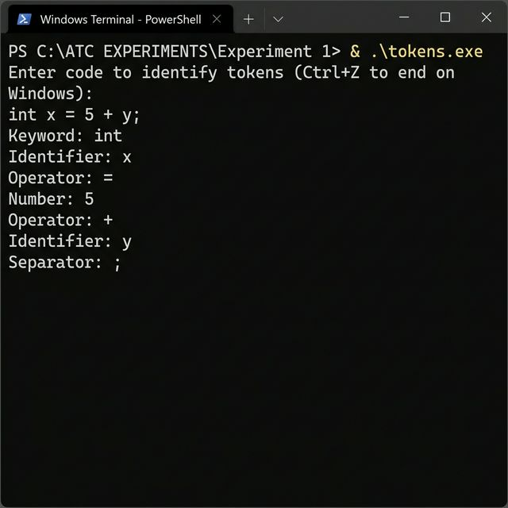

# Experiment 1: Lex Program to Identify Tokens

## Problem Statement
Write a Lex program to identify keywords, identifiers, numbers, and operators from a given C-like input code.

## Source Code
- [tokens.l](tokens.l)

## How to Run
```bash
# Option 1: Lex Version
flex tokens.l
gcc lex.yy.c -o tokens
./tokens

# Option 2: Pure C Version
gcc main.c -o tokens_c
./tokens_c
```

## Actual Output

