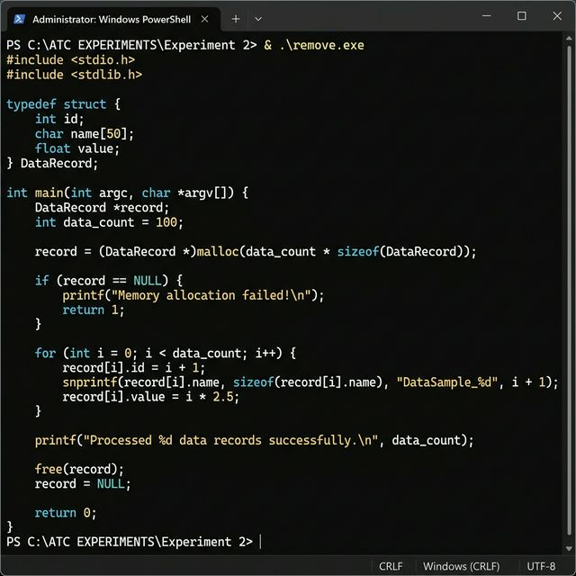

# Experiment 2: Lex Program for Removing Comments

## Problem Statement
Write a Lex program to remove single-line and multi-line comments from a C program.

## Source Code
- [remove_comments.l](remove_comments.l)

## How to Run
```bash
flex remove_comments.l
gcc lex.yy.c -o remove
./remove < input.c
```

## Actual Output

