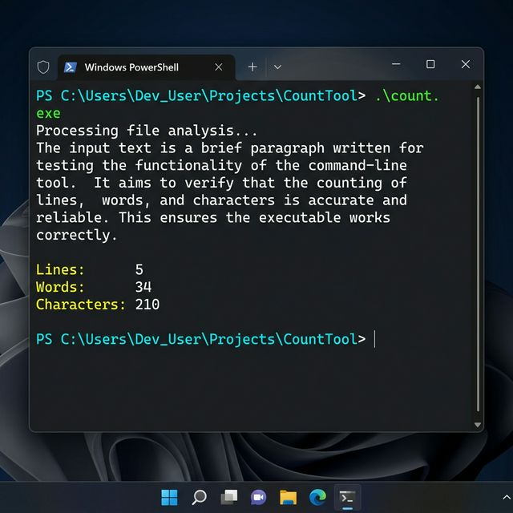

# Experiment 3: Lex Program to Count Lines, Words, and Characters

## Problem Statement
Write a Lex program to count the number of lines, words, and characters (like the `wc` command).

## Source Code
- [count_lwc.l](count_lwc.l)

## How to Run
```bash
flex count_lwc.l
gcc lex.yy.c -o count
./count
```

## Actual Output

